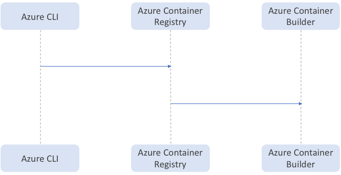

# ACR Tasks

ACR Tasks provides a capability in Azure Container Registry to perform more than simple, container builds in the Azure Container Registry. For running a task we interact with the Azure CLI or SDK. 

This CLI requests the Azure Container Registry to run the task using the Azure Container Builder Runtime.

```sh
az acr task run -f abc.yaml
```



* For documentation around creating a task config, review the documentation [here](docs/README.md).